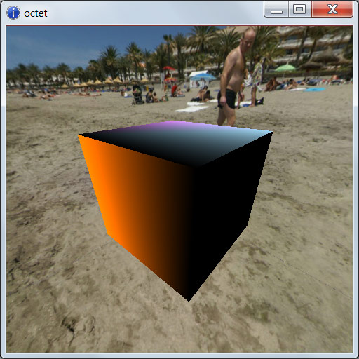
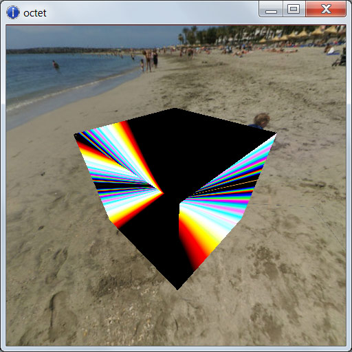
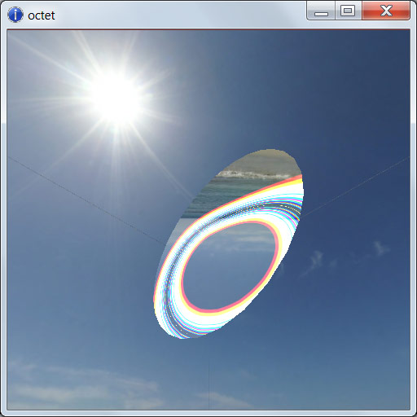

Ciro Durán &lt;<ma302cd@gold.ac.uk>&gt;, Bogdan Catana &lt;<b.i.catana@gmail.com>&gt;\
*Goldsmiths, University of London*\
*MSc Computer Games & Entertainment*\
*Maths & Graphics*\
*Prof. Frederic F. Leymarie*\

*30th January, 2014*

## Introduction

The objective of this report is to describe the development of a software that explores a particular topic on this subject.

The selected topic was to re-implement the Diffraction shader from the first volume of GPU Gems (@Fernando2004). The original implementation uses the Cg shading language and deprecated OpenGL functions, so the reimplementation uses OpenGL ES 2.0 and GLSL shading language.

This topic delves into vector operations for simulating light behaviour.

## Review of Diffraction Simulation

### What is Diffraction?

This describes what diffraction is, with figures. 

Diffraction refers to various phenomena which occur when a wave encounters an obstacle. In classical physics, the diffraction phenomenon is described as the apparent bending of waves around small obstacles and the spreading out of waves past small openings. Similar effects occur when a light wave travels through a medium with a varying refractive index, or a sound wave travels through one with varying acoustic impedance. Diffraction occurs with all waves, including sound waves, water waves, and electromagnetic waves such as visible light, X-rays and radio waves. 

In computer graphics, most surface reflection models ignore the wavelike effects of natural light. This is fine whenever the surface detail is much larger than the wavelength of light (roughly a micron), however for surfaces with small-scale detail such as a compact disc or DVD, wave effects cannot be neglected. And here the phenomenon comes into play, when the small-scale surface detail causes the reflected waves to interfere with one another and it causes the reflected light from these surfaces to exhibit many colorful patterns.

#### The Wave Theory of Light

Basically light behaves as a wave and the ray theory of light used in computer graphics is an approximation of this wave theory. The simple, one-dimensional wave is completely described by a wavelength and an amplitude. As cited from the GPU Gems:

“The wavelength characterizes the oscillating pattern, while the amplitude determines the intensity of the wave. Visible light comprises a superposition of these waves, with wavelengths ranging from 0.5 microns (ultraviolet) to 1 micron (infrared). The color of a light source is determined by the distribution of amplitudes of the waves emanating from it. “

#### The Physics of Diffraction

The simple diffraction shader provided by nVidia models the reflection of light from a surface commonly known as a diffraction grating. A diffraction grating is composed of a set of parallel, narrow reflecting bands separated by a distance. 

A light wave emanating from a light source is usually approximated by a planar wave. A cross section of this wave is depicted by drawing the lines that correspond to the crests of the wave. Unlike a simple, one-dimensional wave, a planar wave requires a specified direction, in addition to its wavelength and amplitude. When this type of planar wave hits the diffraction grating, it generates a spherical wave at each band. The wavelength of the spherical waves is the same as that of the incoming planar, and their crests are depicted similarly. The only difference is that the crests lie on concentric circles instead of parallel lines. The reflected wave at any receiving point away from the surface is equal to the sum of the spherical waves at that location.

The main difference between the wave theory and the usual ray theory is that the amplitudes do not simply add up. Waves interfere. We illustrate this phenomenon in Figure 8-3, where we show two extreme cases. In the first case (a), the two waves are "in phase" and the amplitudes add up, as in the ray theory. In the second case (b), the waves cancel each other, resulting in a wave of zero amplitude. These two cases illustrate that waves can interfere both positively and negatively. In general, the resulting wave lies somewhere in between these two extremes. The first case is, however, the one we are most interested in: When waves interfere in phase, they produce the maximum possible intensity, which eventually will be observed at the receiver.

### Original Implementation

The original implementation is contained in the [nVIDIA Developers site](http://www.nvidia.com/object/gpu_gems_cd.html), being implemented with OpenGL 1.x functions, with shaders written with Cg.

The shader does the vector calculations on the vertex processor, by calculating the color, and the letting the fragment processor interpolate the colors between vertices. This makes the shader highly dependent on the geometry of the object. In [Diffraction2](this figure) we can see that the diffraction effect is not really appreciable with a 6-vertices cube. We also applied the shader on much more defined mesh object, and the differences can also be appreciated at here.

## Reimplementation of the Shader

The reimplementation of the shader was made with OpenGL ES 2.0, with shaders written with GLSL, using Andy Thomason's Octet.

The reimplementation had to consider the differences in the GPU profiles that Cg is capable, and the one that OpenGL ES 2.0 is limited to. This implies the conversion of matrices which the latter is not capable of, so the conversion was made at the moment of loading the shader.

The original shader was written in 2004, a moment where most heavy calculations were done at the vertex processor, so the fragment processor could only interpolate colors. We were quite sure that current GPUs are capable of handling the calculations in this shader at the fragment level. So we did a second shader that moved the color calculation to the fragment processor. Thus, in this second shader, we only do simple vector calculations at the vertex level to move the position, normal and tangent of each vertex, and do the heavy color calculations at the fragment level.

The differences are remarkable using low-poly objects (see figures X and Y). In higher-poly objects the differences are appreciable/not appreciable/nosabenoresponde.

## Tangent Vectors for the Compact Disc

In order to make the implementation work for a CD, we needed to specify the tangent vector, normal and position for each vertex. The tangent vector provides the direction of the tracks. After including the tangent in the mesh, we modified the mesh_builder in order add the tangent in the add_ring() and add_vertex() functions. Now, to have a complete mesh, we needed to have a public function that adds a vertex in the center, then calls add_ring(), and the joins the vertices with the indices. After this we obtained the result exemplified in the following figure (Diffraction 4).

   

## Illustrations

## References
