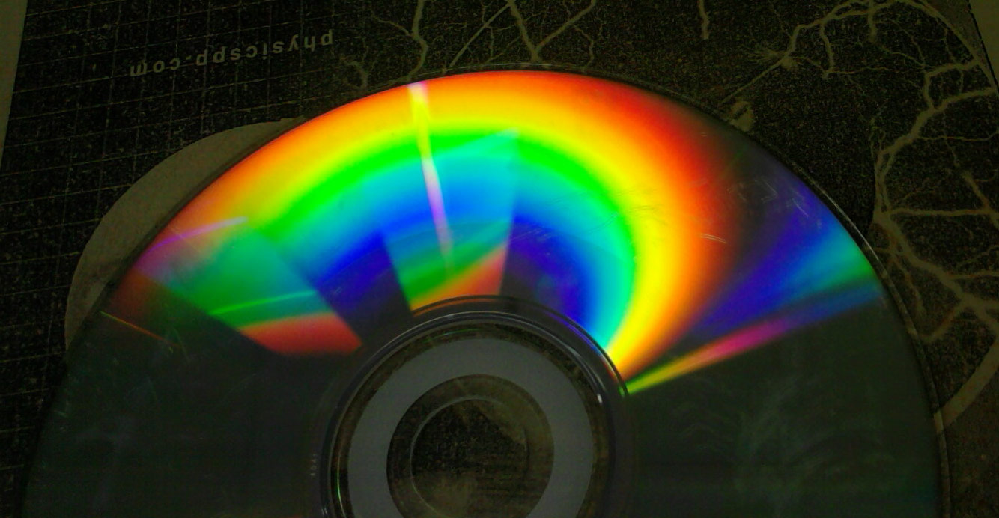
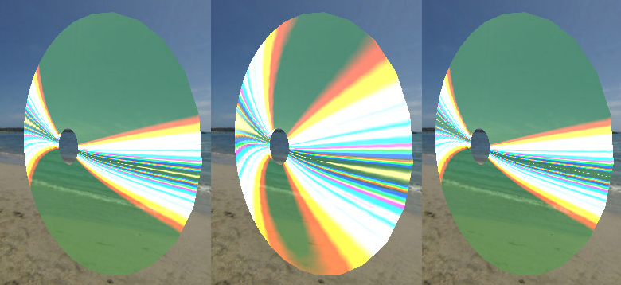

Ciro Duran &lt;<ma302cd@gold.ac.uk>&gt;, Bogdan Catana &lt;<b.i.catana@gmail.com>&gt;\
*Goldsmiths, University of London*\
*MSc Computer Games & Entertainment*\
*Maths & Graphics*\
*Prof. Frederic F. Leymarie*\

*31th January, 2014*

## Introduction

The objective of this report is to describe the development of a software that explores a particular topic on the subject of mathematics. The selected topic was to re-implement the diffraction shader by Jos Stam, from the first volume of GPU Gems (@Fernando2004). The original implementation uses the Cg shading language and deprecated OpenGL functions, so the reimplementation uses OpenGL ES 2.0 and GLSL shading language.

This topic delves into vector operations for simulating light behaviour.

## Review of Light Diffraction

### What is Diffraction?

Diffraction refers to various phenomena which occur when a wave encounters an obstacle. In classical physics, the diffraction phenomenon is described as the apparent bending of waves around small obstacles and the spreading out of waves past small openings. Similar effects occur when a light wave travels through a medium with a varying refractive index, or a sound wave travels through one with varying acoustic impedance. Diffraction occurs with all waves, including sound waves, water waves, and electromagnetic waves such as visible light, X-rays and radio waves. In Figure 2 you can see a picture that illustrates this phenomenon.

In computer graphics, most surface reflection models ignore the wavelike effects of natural light. This is fine whenever the surface detail is much larger than the wavelength of light (roughly a micron), however for surfaces with small-scale detail such as a compact disc or DVD, wave effects cannot be neglected. And here the phenomenon comes into play, when the small-scale surface detail causes the reflected waves to interfere with one another and it causes the reflected light from these surfaces to exhibit many colourful patterns.

### The Physics of Diffraction

The diffraction shader provided by Stam models the reflection of light from a surface commonly known as a diffraction grating. A diffraction grating is composed of a set of parallel, narrow reflecting bands separated by a distance.

A light wave emanating from a light source is approximated by a planar wave. A cross section of this wave is exemplified by drawing the lines that correspond to the crests of the wave (See Figure 3). Unlike a one-dimensional wave, a planar wave requires a specified direction, besides its wavelength and amplitude. When this type of planar wave hits the diffraction grating, it generates a spherical wave at each band.

The wavelength of the spherical waves is the same as that of the incoming planar, and their crests are depicted similarly. The only difference is that the crests lie on concentric circles instead of parallel lines. The reflected wave at any receiving point away from the surface is equal to the sum of the spherical waves at that location. Thus, in the shader implementation we do a sum of various wave intersections at various wavelengths.

## Original Implementation

The original implementation is contained in the [nVIDIA Developers site](http://www.nvidia.com/object/gpu_gems_cd.html), being implemented with OpenGL 1.x functions, with shaders written with Cg.

The original shader does the vector and color calculations on the vertex processor, and lets the fragment processor interpolate the colors between vertices. This makes the shader highly dependent on the geometry of the object. In Figure 4 we can see that the diffraction effect is not really appreciable with a 6-vertices cube. We also applied the shader on much more defined mesh object in Figure 5.

## Reimplementation of the Shader

The reimplementation of the shader was made with OpenGL ES 2.0, with shaders written with GLSL, using Andy Thomason's Octet. You will find the source code of this shader in [GitHub](https://github.com/chiguire/gpugems-chap8).

The reimplementation had to consider the differences in the GPU profiles that Cg is capable, and the one that OpenGL ES 2.0 is limited to. This implies the conversion of matrices which the latter is not capable of, so the conversion was made at the moment of loading the shader.

The original shader was written in 2004, a moment where most heavy calculations were done at the vertex processor, so the fragment processor could only interpolate colors. We were quite sure that current GPUs are capable of handling the calculations in this shader at the fragment level. So we did a second shader that moved the color calculation to the fragment processor. Thus, in this second shader, we only do simple vector calculations at the vertex level to move the position, normal and tangent of each vertex, and do the heavy color calculations at the fragment level. The results are appreciable in Figure 6, for a low-poly mesh, and Figure 7, for a high-poly mesh.

The roughness and spacing are parameters of the shader, and they can be modified at will inside the program, as Figure 9 portrays.

## Tangent Vectors for the Compact Disc

In order to make the implementation work, we needed to specify the tangent, normal and position vectors for each vertex. In our CD example, the data tracks provide the reason for the light diffraction. So the direction of the tracks are the tangent vector of the circle in each point. After including the tangent in the mesh, we modified the mesh_builder in order add the tangent in the add_ring() and add_vertex() functions. Now, to have a complete mesh, we needed to have a public function that adds a ring of vertices around the center, and then calls add_ring() for each segment in the radial axis, and the joins the vertices with the indices. After this we obtained the result exemplified in Figure 8.

## References
